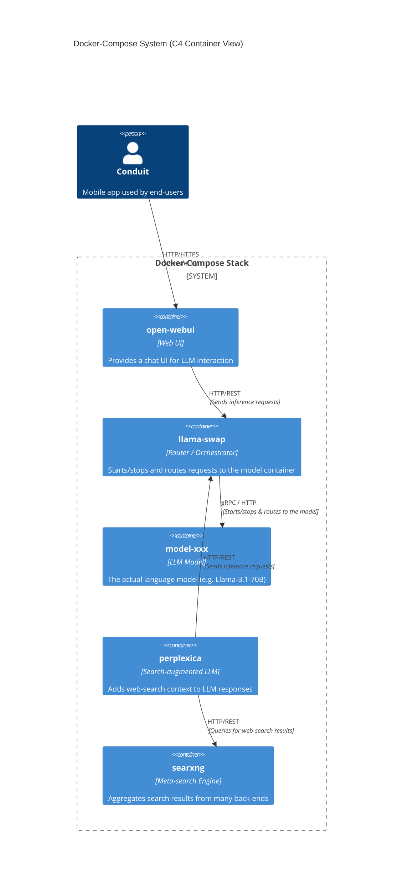

# genai-mei

**genai-mei** is a collection of ready‑to‑run generative‑AI services packaged as Docker images and orchestrated with Docker‑Compose.
The repository bundles a handful of popular models and utilities – LLaMA‑Swap, Perplexica, and a SearXNG search front‑end – providing a single, reproducible environment for experimenting with and deploying AI workloads.

Heavily inspired by https://github.com/VonSnickety/framework-ai-cachyos.
Uses docker images created from https://github.com/kyuz0/amd-strix-halo-toolboxes.

Optimized for AMD Strix Halo w/ Radeon 8060S (gfx1151).
Runs 120B+ models using the 128GB unified memory.

---


## Table of Contents

- [Overview](#overview)
- [Features](#features)
- [Prerequisites](#prerequisites)
- [Installation & Quick Start](#installation--quick-start)
- [Configuration](#configuration)
-   - [Docker Compose](#docker-compose)
-   - [Service‑specific config files](#service-specific-config-files)
- [Running the Services](#running-the-services)
- [Project Structure](#project-structure)
- [Contributing](#contributing)
- [License](#license)

---


## Overview

The repository is organised around a **Docker‑Compose** stack that brings together the following components:

| Component/Service    | Purpose                                                                  | Notes            |
|----------------------|--------------------------------------------------------------------------|------------------|
| `docker-compose.yml` | Orchestrates all services, defines networks and volumes                  | Orchestration    |
| `huggingface`        | HuggingFace `hf` CLI, used to download models, etc.                      | Bootstrapping    |
| `llama-swap`         | LLaMA‑Swap – a lightweight model‑swap utility for LLaMA families         | Default          |
| `perplexica`         | Perplexica is an AI-powered answering engine                             | Default          |
| `searxng`            | Self‑hosted meta‑search engine used by the AI agents (mainly Perplexica) | Default          |
| `open-webui`         | User-friendly AI Interface                                               | Non default      |
| `mistral-vibe`       | Mistral Vibe – a CLI‑driven coding‑assistant built on Devstral models    | Manual           |

All services expose HTTP APIs (or CLI entry points) that can be consumed by downstream applications or by the other services in the stack.


## Features

- **Modular Docker images** – each AI component lives in its own folder with a minimal Dockerfile.
- **Unified orchestration** – a single `docker-compose.yml` brings up the whole stack with one command.
- **Configurable per‑service** – YAML/TOML configuration files are mounted as volumes, making it easy to tweak model paths, ports, and runtime flags without rebuilding images.
- **Persisted data** – SQLite DB for Perplexica and volume mounts for model caches ensure data survives container restarts.
- **Ready for extension** – add new services by dropping a folder with a Dockerfile and updating `docker-compose.yml`.


## Prerequisites
### Hardware Requirements

- **AMD Ryzen AI Max+ 395** (or other Strix Halo APU)
- **128GB unified memory** (for large model inference)
- Tested on Framework Desktop


### Software Prerequisites

- Container runtime - Podamn API service (tested on Podman 5.7.1)
- Docker‑Compose (v2 syntax)


### Kernel Parameters

Add these to your bootloader (systemd-boot or GRUB):

```
amdgpu.gttsize=131072    # 128GB GTT aperture for large models
ttm.pages_limit=33554432 # Increase TTM page limit
amd_iommu=off            # Disable IOMMU (causes issues with ROCm)
```


## Installation & Quick Start

```bash
# Clone the repository
git clone https://github.com/berney/genai‑mei.git
cd genai‑mei

# Install models
docker compose run --rm facehugger

# Start default services
docker compose up
```

The command will:
1. Pull, falling back to building, each Docker image from its respective `Dockerfile`.
2. Use facehugger to download any missing models and verify the models integrity.
3. Start containers and expose the ports defined in `docker-compose.yml`.

You can verify that everything is running with:

```bash
docker compose ps
```


## Configuration

### Docker Compose

The top‑level `docker-compose.yml` defines the services, networks, and volumes.

Service profiles are used to control which services are default.
Services with an assigned profile are not default, and need to be manually started.

Most runtime options (ports, environment variables, bind‑mounts) are declared there.
Feel free to edit the file to change host ports or to add extra environment variables.


### Service‑specific config files

- **facehugger** – Used for bootstrapping and to add new models after editing the facehugger manifest `facehugger.yaml` file.
- **LLaMA‑Swap** – configuration lives in `llama-swap/config.yaml` - this defines models available.
- **Mistral‑Vibe** – primary settings are in `mistral-vibe/config.toml`.  Adjust the `model_path`, `api_key`, or logging options as needed.
- **Perplexica** – The config file `perplexica/data/config.json` has the base URL for SearxNG. Chat history etc stored in `perplexica/data/` is not tracked by git.
- **SearXNG** – tweak the search behaviour in `searxng/settings.yml`.

All config files are mounted read‑only into the containers, so changes take effect after a container restart (`docker compose restart <service>`).


## Running the Services

Below are the default ports (as defined in `docker-compose.yml`). Adjust them in the compose file if they clash with existing services on your host.

| Service         | Purpose          | Profile         | URL (containers)        | URL (host) |
|-----------------|------------------|-----------------|-------------------------|------------------------|
| `llama-swap`    | LLaMA‑Swap API   | default         | http://llama-swap:8080/ | http://localhost:8090/ |
| `perplexica`    | Perplexica UI    | default         | http://perplexica:3001/ | http://localhost:3001/ |
| `searxng`       | SearXNG UI       | default         | http://searxng:8080/    | http://localhost:8185/ |
| `open-webui`    | Open WebUI       | `open-webui`    | http://open-webui:8080/ | http://localhost:8080/ |
| `huggingface`   | Bootstrapping    | `huggingface`   | N/A                     | N/A                    |
| `minstral-vibe` | Mistral‑Vibe CLI | `minstral-vibe` | N/A                     | N/A                    |

You can interact with the HTTP services using your web browser, `xh`, `curl`, etc.

> **Tip:** To chat with a model, open the llama-swap UI and click on a loaded model to access the llama.cpp chat interface.


## Models

**Always loaded:**
| Model         | Purpose                     |
|---------------|-----------------------------|
| Qwen3-4B-128K | Fast responses, quick tasks |

> **Note:** Perplexica handles embeddings locally via transformers.js - no external embedding model needed.

**Swappable** (via ROCm7 backend - one at a time):
| Model                   | Aliases | Purpose |
|-------------------------|-------------------------------------|--------------------------------|
| Qwen3-Coder-30B-A3B     | `coder`, `code`, `dev`              | Coding (MoE, 3B active params) |
| DeepSeek-R1-Distill-70B | `deepseek`, `r1`, `reasoning`       | Chain-of-thought reasoning     |
| Llama-4-Scout-17B-16E   | `scout`, `vision`, `multimodal`     | Vision + text (MoE)            |
| Heretic-GPT-OSS-120B    | `gpt-120b`, `heretic`, `uncensored` | Large uncensored model         |


## Testing

### `xh`
```bash
# Check loaded models
xh localhost:8090/running

# List available models
xh localhost:8090/v1/models

# Test inference
xh localhost:8090/v1/chat/completions content-type:application/json model=heretic-gpt-oss-120b max_tokens:=50 messages:='[{"role": "user", "content": "Hello!"}]'
```

### `curl`

```bash
# Check loaded models
curl -s http://localhost:8090/running | jq

# List available models
curl -s http://localhost:8090/v1/models | jq

# Test inference
curl -s http://localhost:8090/v1/chat/completions \
  -H "Content-Type: application/json" \
  -d '{"model":"qwen-coder-30b","messages":[{"role":"user","content":"Hello!"}],"max_tokens":50}'
```


## Benchmarking

* The `docker-compose.yml` has services for benchmarking in the form `<model>-benchmark`.
* The helper script `./benchmark` will run each benchmark service one by one.

```bash
docker compose run --rm gpt-120b-benchmark
```

```bash
./benchmark
```

**Key metrics:**
- **pp** (prompt processing) - tokens/sec for processing input
- **tg** (text generation) - tokens/sec for generating output

**Common flags:**
| Flag | Description |
|------|-------------|
| `-m` | Model path |
| `-p` | Prompt sizes to test (comma-separated) |
| `-n` | Tokens to generate |
| `-ngl` | GPU layers (999 = all) |
| `-fa` | Flash attention (1 = on) |
| `-t` | CPU threads |


### Results (2026-02-04)
```
ggml_vulkan: Found 1 Vulkan devices:
ggml_vulkan: 0 = Radeon 8060S Graphics (RADV GFX1151) (radv) | uma: 1 | fp16: 1 | bf16: 0 | warp size: 64 | shared memory: 65536 | int dot: 1 | matrix cores: KHR_coopmat
build: 6a9bf2f78 (7928)
```

```
ggml_cuda_init: found 1 ROCm devices:
  Device 0: Radeon 8060S Graphics, gfx1151 (0x1151), VMM: no, Wave Size: 32
build: 6a9bf2f78 (7928)
```

#### heretic-gpt-oss-120b-benchmark - Vulkan RADV
| model                          |       size |     params | backend    | ngl |            test |                  t/s |
| ------------------------------ | ---------: | ---------: | ---------- | --: | --------------: | -------------------: |
| gpt-oss 120B BF16              |  60.87 GiB |   116.83 B | Vulkan     | 999 |           pp512 |       365.29 ± 56.95 |
| gpt-oss 120B BF16              |  60.87 GiB |   116.83 B | Vulkan     | 999 |          pp1024 |       402.12 ± 18.75 |
| gpt-oss 120B BF16              |  60.87 GiB |   116.83 B | Vulkan     | 999 |          pp2048 |        408.57 ± 7.77 |
| gpt-oss 120B BF16              |  60.87 GiB |   116.83 B | Vulkan     | 999 |           tg128 |         33.92 ± 0.27 |


#### heretic-gpt-oss-120b-vulkan-amdvlk-benchmark - Vulkan AMDVLK
| model                          |       size |     params | backend    | ngl |            test |                  t/s |
| ------------------------------ | ---------: | ---------: | ---------- | --: | --------------: | -------------------: |
| gpt-oss 120B BF16              |  60.87 GiB |   116.83 B | Vulkan     | 999 |           pp512 |       362.24 ± 60.31 |
| gpt-oss 120B BF16              |  60.87 GiB |   116.83 B | Vulkan     | 999 |          pp1024 |       413.29 ± 11.31 |
| gpt-oss 120B BF16              |  60.87 GiB |   116.83 B | Vulkan     | 999 |          pp2048 |        410.09 ± 6.28 |
| gpt-oss 120B BF16              |  60.87 GiB |   116.83 B | Vulkan     | 999 |           tg128 |         33.93 ± 0.13 |


#### heretic-gpt-oss-120b-rocm-6.4.4-benchmark - ROCm v6.4.4

| model                          |       size |     params | backend    | ngl |            test |                  t/s |
| ------------------------------ | ---------: | ---------: | ---------- | --: | --------------: | -------------------: |
| gpt-oss 120B BF16              |  60.87 GiB |   116.83 B | ROCm       | 999 |           pp512 |       521.72 ± 86.65 |
| gpt-oss 120B BF16              |  60.87 GiB |   116.83 B | ROCm       | 999 |          pp1024 |        543.77 ± 6.57 |
| gpt-oss 120B BF16              |  60.87 GiB |   116.83 B | ROCm       | 999 |          pp2048 |        518.01 ± 5.87 |
| gpt-oss 120B BF16              |  60.87 GiB |   116.83 B | ROCm       | 999 |           tg128 |         35.66 ± 0.04 |


#### heretic-gpt-oss-120b-rocm-7.2-benchmark - ROCm v7.2
| model                          |       size |     params | backend    | ngl |            test |                  t/s |
| ------------------------------ | ---------: | ---------: | ---------- | --: | --------------: | -------------------: |
| gpt-oss 120B BF16              |  60.87 GiB |   116.83 B | ROCm       | 999 |           pp512 |       167.90 ± 15.38 |
| gpt-oss 120B BF16              |  60.87 GiB |   116.83 B | ROCm       | 999 |          pp1024 |        184.37 ± 3.24 |
| gpt-oss 120B BF16              |  60.87 GiB |   116.83 B | ROCm       | 999 |          pp2048 |        182.95 ± 1.03 |
| gpt-oss 120B BF16              |  60.87 GiB |   116.83 B | ROCm       | 999 |           tg128 |         36.09 ± 0.14 |


#### heretic-gpt-oss-120b-rocm7-nightlies-benchmark - ROCm 7 Nightlies
| model                          |       size |     params | backend    | ngl |            test |                  t/s |
| ------------------------------ | ---------: | ---------: | ---------- | --: | --------------: | -------------------: |
| gpt-oss 120B BF16              |  60.87 GiB |   116.83 B | ROCm       | 999 |           pp512 |        274.87 ± 6.01 |
| gpt-oss 120B BF16              |  60.87 GiB |   116.83 B | ROCm       | 999 |          pp1024 |        272.50 ± 2.90 |
| gpt-oss 120B BF16              |  60.87 GiB |   116.83 B | ROCm       | 999 |          pp2048 |        269.60 ± 1.18 |
| gpt-oss 120B BF16              |  60.87 GiB |   116.83 B | ROCm       | 999 |           tg128 |         36.07 ± 0.04 |


#### heretic-gpt-oss-120b-q8-benchmark - Vulkan RADV
| model                          |       size |     params | backend    | ngl |            test |                  t/s |
| ------------------------------ | ---------: | ---------: | ---------- | --: | --------------: | -------------------: |
| gpt-oss 120B Q8_0              |  59.02 GiB |   116.83 B | Vulkan     | 999 |           pp512 |       420.24 ± 67.99 |
| gpt-oss 120B Q8_0              |  59.02 GiB |   116.83 B | Vulkan     | 999 |          pp1024 |       459.69 ± 21.27 |
| gpt-oss 120B Q8_0              |  59.02 GiB |   116.83 B | Vulkan     | 999 |          pp2048 |        469.26 ± 9.69 |
| gpt-oss 120B Q8_0              |  59.02 GiB |   116.83 B | Vulkan     | 999 |           tg128 |         53.16 ± 0.69 |


#### qwen3-4b-128k-q6-benchmark - Vulkan RADV
| model                          |       size |     params | backend    | ngl |            test |                  t/s |
| ------------------------------ | ---------: | ---------: | ---------- | --: | --------------: | -------------------: |
| qwen3 4B Q6_K                  |   3.40 GiB |     4.02 B | Vulkan     | 999 |           pp512 |     1433.30 ± 585.34 |
| qwen3 4B Q6_K                  |   3.40 GiB |     4.02 B | Vulkan     | 999 |          pp1024 |      1407.10 ± 10.17 |
| qwen3 4B Q6_K                  |   3.40 GiB |     4.02 B | Vulkan     | 999 |          pp2048 |      1289.21 ± 51.65 |
| qwen3 4B Q6_K                  |   3.40 GiB |     4.02 B | Vulkan     | 999 |           tg128 |         53.52 ± 0.55 |


#### qwen3-4b-128k-q8-benchmark - Vulkan RADV
| model                          |       size |     params | backend    | ngl |            test |                  t/s |
| ------------------------------ | ---------: | ---------: | ---------- | --: | --------------: | -------------------: |
| qwen3 4B Q8_0                  |   4.70 GiB |     4.02 B | Vulkan     | 999 |           pp512 |     1362.02 ± 530.36 |
| qwen3 4B Q8_0                  |   4.70 GiB |     4.02 B | Vulkan     | 999 |          pp1024 |       1344.74 ± 9.91 |
| qwen3 4B Q8_0                  |   4.70 GiB |     4.02 B | Vulkan     | 999 |          pp2048 |      1227.25 ± 56.08 |
| qwen3 4B Q8_0                  |   4.70 GiB |     4.02 B | Vulkan     | 999 |           tg128 |         39.88 ± 0.27 |


#### qwen-coder-30b-benchmark - Vulkan RADV
| model                          |       size |     params | backend    | ngl |            test |                  t/s |
| ------------------------------ | ---------: | ---------: | ---------- | --: | --------------: | -------------------: |
| qwen3moe 30B.A3B Q8_0          |  30.25 GiB |    30.53 B | Vulkan     | 999 |           pp512 |      823.05 ± 273.96 |
| qwen3moe 30B.A3B Q8_0          |  30.25 GiB |    30.53 B | Vulkan     | 999 |          pp1024 |        849.62 ± 8.57 |
| qwen3moe 30B.A3B Q8_0          |  30.25 GiB |    30.53 B | Vulkan     | 999 |          pp2048 |       834.90 ± 45.81 |
| qwen3moe 30B.A3B Q8_0          |  30.25 GiB |    30.53 B | Vulkan     | 999 |           tg128 |         58.50 ± 0.29 |


#### glm-4.7-flash-benchmark - Vulkan RADV
| model                          |       size |     params | backend    | ngl |            test |                  t/s |
| ------------------------------ | ---------: | ---------: | ---------- | --: | --------------: | -------------------: |
| deepseek2 30B.A3B Q8_0         |  32.70 GiB |    29.94 B | Vulkan     | 999 |           pp512 |      782.68 ± 204.15 |
| deepseek2 30B.A3B Q8_0         |  32.70 GiB |    29.94 B | Vulkan     | 999 |          pp1024 |        816.62 ± 6.17 |
| deepseek2 30B.A3B Q8_0         |  32.70 GiB |    29.94 B | Vulkan     | 999 |          pp2048 |       740.43 ± 22.25 |
| deepseek2 30B.A3B Q8_0         |  32.70 GiB |    29.94 B | Vulkan     | 999 |           tg128 |         38.68 ± 0.19 |


----

### Results (2026-02-01)

```
ggml_vulkan: Found 1 Vulkan devices:
ggml_vulkan: 0 = Radeon 8060S Graphics (RADV GFX1151) (radv) | uma: 1 | fp16: 1 | bf16: 0 | warp size: 64 | shared memory: 65536 | int dot: 1 | matrix cores: KHR_coopmat
build: 785a71008 (7751)
```

#### heretic-gpt-oss-120b-benchmark
| model                          |       size |     params | backend    | ngl |            test |                  t/s |
| ------------------------------ | ---------: | ---------: | ---------- | --: | --------------: | -------------------: |
| gpt-oss 120B BF16              |  60.87 GiB |   116.83 B | Vulkan     | 999 |           pp512 |       397.06 ± 63.81 |
| gpt-oss 120B BF16              |  60.87 GiB |   116.83 B | Vulkan     | 999 |          pp1024 |        415.94 ± 3.55 |
| gpt-oss 120B BF16              |  60.87 GiB |   116.83 B | Vulkan     | 999 |          pp2048 |        403.22 ± 7.22 |
| gpt-oss 120B BF16              |  60.87 GiB |   116.83 B | Vulkan     | 999 |           tg128 |         33.21 ± 0.14 |

| model                          |       size |     params | backend    | ngl |            test |                  t/s |
| ------------------------------ | ---------: | ---------: | ---------- | --: | --------------: | -------------------: |
| gpt-oss 120B Q8_0              |  59.02 GiB |   116.83 B | Vulkan     | 999 |           pp512 |       456.17 ± 80.81 |
| gpt-oss 120B Q8_0              |  59.02 GiB |   116.83 B | Vulkan     | 999 |          pp1024 |        481.15 ± 5.39 |
| gpt-oss 120B Q8_0              |  59.02 GiB |   116.83 B | Vulkan     | 999 |          pp2048 |       460.40 ± 10.75 |
| gpt-oss 120B Q8_0              |  59.02 GiB |   116.83 B | Vulkan     | 999 |           tg128 |         51.94 ± 0.42 |

#### qwen-coder-30b-benchmark
| model                          |       size |     params | backend    | ngl |            test |                  t/s |
| ------------------------------ | ---------: | ---------: | ---------- | --: | --------------: | -------------------: |
| qwen3moe 30B.A3B Q8_0          |  30.25 GiB |    30.53 B | Vulkan     | 999 |           pp512 |      884.78 ± 289.41 |
| qwen3moe 30B.A3B Q8_0          |  30.25 GiB |    30.53 B | Vulkan     | 999 |          pp1024 |        898.51 ± 9.74 |
| qwen3moe 30B.A3B Q8_0          |  30.25 GiB |    30.53 B | Vulkan     | 999 |          pp2048 |       832.07 ± 26.59 |
| qwen3moe 30B.A3B Q8_0          |  30.25 GiB |    30.53 B | Vulkan     | 999 |           tg128 |         56.82 ± 0.44 |


#### qwen3-4b-128k-q6-benchmark
| model                          |       size |     params | backend    | ngl |            test |                  t/s |
| ------------------------------ | ---------: | ---------: | ---------- | --: | --------------: | -------------------: |
| qwen3 4B Q6_K                  |   3.40 GiB |     4.02 B | Vulkan     | 999 |           pp512 |     1397.98 ± 526.46 |
| qwen3 4B Q6_K                  |   3.40 GiB |     4.02 B | Vulkan     | 999 |          pp1024 |      1391.30 ± 14.13 |
| qwen3 4B Q6_K                  |   3.40 GiB |     4.02 B | Vulkan     | 999 |          pp2048 |      1252.43 ± 79.78 |
| qwen3 4B Q6_K                  |   3.40 GiB |     4.02 B | Vulkan     | 999 |           tg128 |         53.54 ± 0.92 |


#### qwen3-4b-128k-q8-benchmark
| model                          |       size |     params | backend    | ngl |            test |                  t/s |
| ------------------------------ | ---------: | ---------: | ---------- | --: | --------------: | -------------------: |
| qwen3 4B Q8_0                  |   4.70 GiB |     4.02 B | Vulkan     | 999 |           pp512 |     1347.67 ± 489.56 |
| qwen3 4B Q8_0                  |   4.70 GiB |     4.02 B | Vulkan     | 999 |          pp1024 |      1327.16 ± 19.00 |
| qwen3 4B Q8_0                  |   4.70 GiB |     4.02 B | Vulkan     | 999 |          pp2048 |      1204.72 ± 65.33 |
| qwen3 4B Q8_0                  |   4.70 GiB |     4.02 B | Vulkan     | 999 |           tg128 |         39.77 ± 0.42 |

#### glm-4.7-flash-benchmark
| model                          |       size |     params | backend    | ngl |            test |                  t/s |
| ------------------------------ | ---------: | ---------: | ---------- | --: | --------------: | -------------------: |
| deepseek2 ?B Q8_0              |  32.70 GiB |    29.94 B | Vulkan     | 999 |           pp512 |      784.96 ± 196.90 |
| deepseek2 ?B Q8_0              |  32.70 GiB |    29.94 B | Vulkan     | 999 |          pp1024 |       802.44 ± 10.79 |
| deepseek2 ?B Q8_0              |  32.70 GiB |    29.94 B | Vulkan     | 999 |          pp2048 |       721.81 ± 21.81 |
| deepseek2 ?B Q8_0              |  32.70 GiB |    29.94 B | Vulkan     | 999 |           tg128 |         38.06 ± 0.20 |


### Results (2026-01-28)

```
ggml_vulkan: Found 1 Vulkan devices:
ggml_vulkan: 0 = Radeon 8060S Graphics (RADV GFX1151) (radv) | uma: 1 | fp16: 1 | bf16: 0 | warp size: 64 | shared memory: 65536 | int dot: 1 | matrix cores: KHR_coopmat
build: 785a71008 (7751)
```

#### glm-4.7-flash-benchmark

| model                          |       size |     params | backend    | ngl |            test |                  t/s |
| ------------------------------ | ---------: | ---------: | ---------- | --: | --------------: | -------------------: |
| deepseek2 ?B Q8_0              |  32.70 GiB |    29.94 B | Vulkan     | 999 |           pp512 |      798.57 ± 223.20 |
| deepseek2 ?B Q8_0              |  32.70 GiB |    29.94 B | Vulkan     | 999 |          pp1024 |        818.51 ± 6.08 |
| deepseek2 ?B Q8_0              |  32.70 GiB |    29.94 B | Vulkan     | 999 |          pp2048 |       729.29 ± 24.46 |
| deepseek2 ?B Q8_0              |  32.70 GiB |    29.94 B | Vulkan     | 999 |           tg128 |         38.52 ± 0.21 |

#### heretic-gpt-oss-120b-benchmark

| model                          |       size |     params | backend    | ngl |            test |                  t/s |
| ------------------------------ | ---------: | ---------: | ---------- | --: | --------------: | -------------------: |
| gpt-oss 120B BF16              |  60.87 GiB |   116.83 B | Vulkan     | 999 |           pp512 |       399.93 ± 72.97 |
| gpt-oss 120B BF16              |  60.87 GiB |   116.83 B | Vulkan     | 999 |          pp1024 |        424.30 ± 2.43 |
| gpt-oss 120B BF16              |  60.87 GiB |   116.83 B | Vulkan     | 999 |          pp2048 |        411.80 ± 8.58 |
| gpt-oss 120B BF16              |  60.87 GiB |   116.83 B | Vulkan     | 999 |           tg128 |         33.63 ± 0.15 |


#### qwen-coder-30b-benchmark
| model                          |       size |     params | backend    | ngl |            test |                  t/s |
| ------------------------------ | ---------: | ---------: | ---------- | --: | --------------: | -------------------: |
| qwen3moe 30B.A3B Q8_0          |  30.25 GiB |    30.53 B | Vulkan     | 999 |           pp512 |      910.44 ± 298.85 |
| qwen3moe 30B.A3B Q8_0          |  30.25 GiB |    30.53 B | Vulkan     | 999 |          pp1024 |        916.41 ± 4.78 |
| qwen3moe 30B.A3B Q8_0          |  30.25 GiB |    30.53 B | Vulkan     | 999 |          pp2048 |       831.39 ± 60.64 |
| qwen3moe 30B.A3B Q8_0          |  30.25 GiB |    30.53 B | Vulkan     | 999 |           tg128 |         57.99 ± 0.46 |


## GPU Backend Notes

- **ROCm7** is used for all models (native gfx1151 support via kyuz0's container)
- **Do NOT set `HSA_OVERRIDE_GFX_VERSION`** - causes kernel mismatches on Strix Halo
- Set `HSA_ENABLE_SDMA=0` in ROCm containers to prevent DMA issues


## Project Structure

```
genai-mei/
├── huggingface/            # HuggingFace CLI container
│   └── Dockerfile
├── llama-swap/             # LLaMA‑Swap service
│   ├── config.default.yaml
│   ├── config.jesse.yaml
│   ├── config.yaml
│   └── Dockerfile
├── mistral-vibe/           # Mistral Vibe coding‑assistant
│   ├── config.docker-compose.toml
│   ├── config.toml
│   └── Dockerfile
├── perplexica/             # AI powered answering engine
│   └── data/
│       ├── config.json
│       └── db.sqlite
├── searxng/                # Self‑hosted meta‑search engine
│   └── settings.yml
├── docker-compose.yml      # Orchestrates all services
└── LICENSE                 # Project license
```


## Architecture

* I've tried to capture everything as code (Infrastructure as Code).
* I've tried to containerise everything to make it agonostic to the host OS.
* Centralised on docker-compose - the models are services in docker-compose, and llama-swap starts and stops docker-compose services.
  This means you can start and stop models via `docker compose` yourself - you could drop llama-swap.
  Using llama-swap gives niceness like shutdown unused models, freeing resources, and saving energy.
* The podman user socket is mounted into `llama-swap` container.
  The `podman` and `docker-compose` binaries have been installed.
  The parent directory of the docker-compose.yml on the host should match inside the container (e.g. both `genai-mei`), as the container names are based on the parent.
* Built on a podman system.
  Intend in future to support docker engine, but some changes probably needed atm to get it working.

### Diagram



## Whisper

### Testing

```bash
curl -X POST http://localhost:8999/v1/audio/transcriptions \
     -F "file=@/home/bdawg/Documents/bdawg-hear-me-rawr.wav"
```

```json
{"text":" I am my big dog, hear me roar.\n"}%
```

## Contributing

This repo mainlys serves myself and to share with others what I did and how I did it.
Ideas are welcomed, I'm always looking to improve things, if it fits my vision.


## License

This project is licensed under the **AGPL-3.0 License** – see the `LICENSE` file for details.
